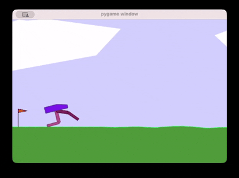
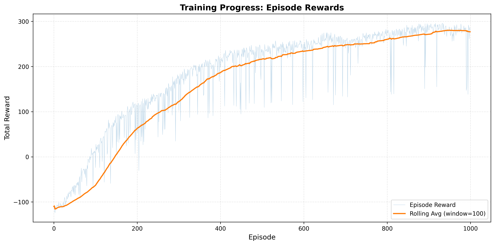

# BipedalWalker PPO

An implementation of Proximal Policy Optimization (PPO) for solving the BipedalWalker-v3 environment from OpenAI Gymnasium.

---

## Overview

This project trains a bipedal robot to walk using PPO, a policy gradient reinforcement learning algorithm. The agent learns to coordinate its four joints to maintain balance and move forward efficiently.

---

## Trained Agent Demo

Below is a GIF showing the DQN agent successfully playing Flappy Bird after training.

<p align="center">
  
</p>

---

## Training Progress

The following plot shows the episode rewards with average reward progression over 1000 episodes of training:

 

---

## Project Structure

```
bipedal-ppo/
├── config.py        # Hyperparameters and training configuration
├── models.py        # Policy and Value network architectures
├── ppo_trainer.py   # Core PPO training functions
├── main.py          # Main training and testing script
└── final.pth        # The trained model
```

### Files Descriptions

- **config.py**: Contains all hyperparameters including learning rate, batch size, clipping epsilon, discount factor (gamma), GAE lambda, and training episodes
- **models.py**: Defines `PolNet` (policy network) and `ValNet` (value network) using PyTorch
- **trainer.py**: Implements trajectory collection, GAE computation, and PPO update logic
- **main.py**: The training loop and runs test episodes with visualization

---

## Requirements

```bash
pip install gymnasium torch numpy box2d-py
```

---

## Usage

### 1. Clone or download this repository
```bash
git clone https://github.com/Mahdi-Razi-Gandomani/bipedal-walker-PPO.git
cd bipedal-walker-PPO
```

### Training

```bash
python3 main.py
```

The script will:
1. Initialize the BipedalWalker environment
2. Train the agent for 1000 episodes
3. Display progress every 100 episodes
4. Save the trained model as `final.pth`
5. Run 5 test episodes with visualization


### Testing Only

To test a previously trained model, modify `main.py` to load the saved weights:

```python
pol.load_state_dict(torch.load('final.pth'))
```

Then comment out the training loop and run only the testing section.


---

## Details

### PPO (Proximal Policy Optimization)

PPO is an on-policy algorithm that:
1. Collects trajectories using the current policy
2. Computes advantages using Generalized Advantage Estimation (GAE)
3. Updates the policy using a clipped surrogate objective
4. Updates the value function to better predict returns

**Key Features:**
- Clipped objective prevents overly large policy updates
- Entropy bonus encourages exploration
- Orthogonal weight initialization for stable training
- Gradient clipping for training stability

### Networks

**Policy Network (PolNet):**
- Input: 24-dimensional state space
- Hidden layers: 256 → 128
- Outputs: Mean and log standard deviation for 4 continuous actions
- Actions bounded by tanh activation

**Value Network (ValNet):**
- Input: 24-dimensional state space
- Hidden layers: 256 → 128
- Output: Single value estimate

---

## References

[1] J. Schulman, F. Wolski, P. Dhariwal, A. Radford, and O. Klimov, *Proximal Policy Optimization Algorithms*, arXiv preprint arXiv:1707.06347, 2017.

[2] [OpenAI Gymnasium BipedalWalker](https://gymnasium.farama.org/environments/box2d/bipedal_walker/)


